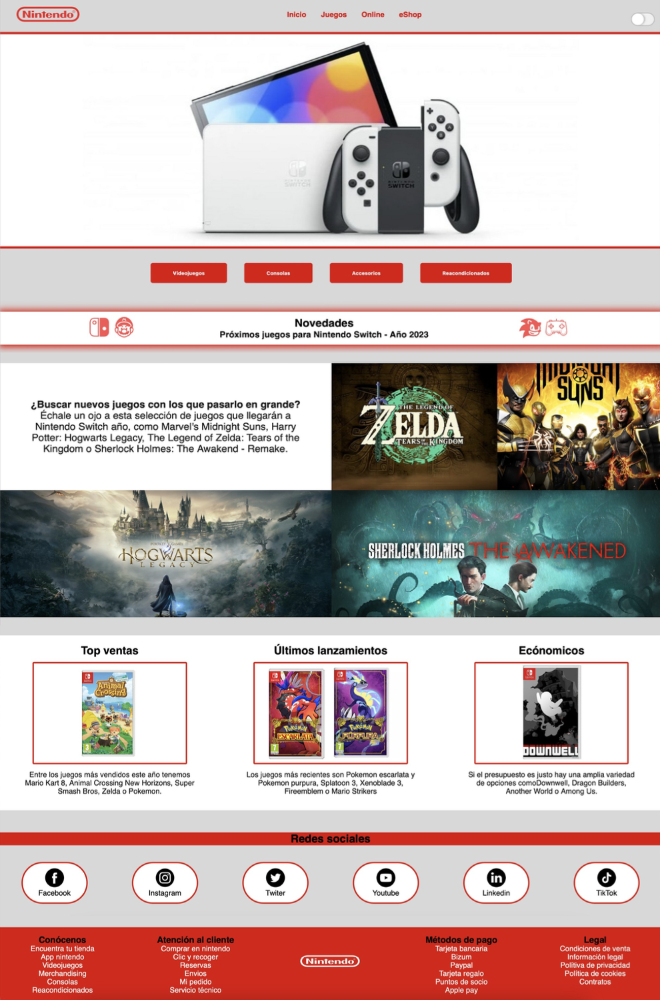
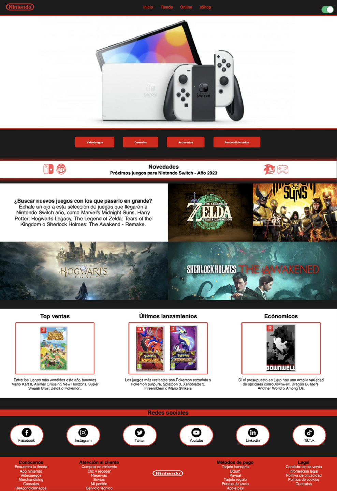

# ⚠️ Antes de comenzar ⚠️
Importante aclarar que no es una página web real, es un proyecto creado para el módulo de Desarrollo web en entorno cliente y Diseño de interfaces web para segundo de ciclo de Desarrollo de aplicaciones web.

# Nintendo Switch
Este proyecto va sobre un web tanto de Nintendo Switch como de los juegos que ofrece. En el cuál, sus principales funciones son mostrar los tipos de nintendo switch actuales, dar a conocer los próximos juegos que saldra, dar ideas, sobre juegos más vendidos, económicos o los más recientes y mostrar los enlaces a sus redes sociales.

# 📸 Página principal
## Modo claro

## Modo oscuro

# Uso de la aplicación
Actualemente su única funcinalidad es ver juegos, nintendos e información de ambos, pero a continuación explico las funcionalidades que le añadiré al proyecto:

## 👤Usuario sin cuenta
El usuario que aún no tenga cuenta o no haya hecho login con sus datos, solo podrá visualizar la página principal para ver un los tipos de nintendo, información de nuevos juegos y los juegos que se vende.

## 👤Usuario con cuenta
1. Para poder usar la web, si es nuevo usuario, primero tienen que registrarse, si ya tienes cuenta tendrás que hacer login, para  acceder a dichas páginas tendría que darle al icono de usuario que hay arriba a la derecha en el menú, de ahí se desplegarán dos opciones, iniciar sesión o regitrarse.

2. Si es nuevo usuario, nada más registrarse se le redirigirá a la página de iniciar sesión, sea nuevo usuario o no, nada más iniciar sesión irá de manera automática a la página de inicio.

3. Una vez en el inicio tendrá varias opciones, visualizar la página principal ya que es meramente informativa, en la cuál se apreciaran unos botones rojos donde se podrá acceder a la tienda de videojuegos, consolas, accesorios y reacondicionados.

4. Si accede a alguno de los botones nombrados en el apartado anterior se le redirigira a la tienda online donde podrá comprar cualquier cosa que vea en ella.

5. En el menú de a web encontrará cuatro opciones a elegir (inicio, tienda, online, eShop), en inicio como su mimso nombre indica podrá volver a la página principal, en tienda, acceder a todas las opciones de compra que ofrece la web, en online podrá ver que tipo de suscripciones online hay, con sus respectivas características y precios (meramente informativo) y en eShop podrá ver los precios que hay para los juegos y comprarlos por medio de la consola de manera virtual.

5. En el menú de a web encontrará cuatro opciones a elegir (inicio, tienda, online, eShop), en inicio como su mimso nombre indica podrá volver a la página principal, en tienda, acceder a todas las opciones de compra que ofrece la web, en online podrá ver que tipo de suscripciones online hay, con sus respectivas características y precios (meramente informativo) y en eShop podrá ver los precios que hay para los juegos y comprarlos por medio de la consola de manera virtual.

6. En el carrito de compras (en el menú), podrá almacenar las cosas que quiere comprar y proceder al pago.

7. En la parte superior derecha hay un botón que simplemente cambia el fondo de la web, dependiendo si lo quiere en modo oscuro o claro.

# 🪛Tecnologías
Para llevar a cabo la realización de este proyecto, he utilizado:
* HTML
* CSS
* JAVASCRIPT
* Github

# 👩🏻‍💻Autora
* Sara Marrero Miranda

# 🔔 AVISO
Actualmente estoy mejorando el código existente.
